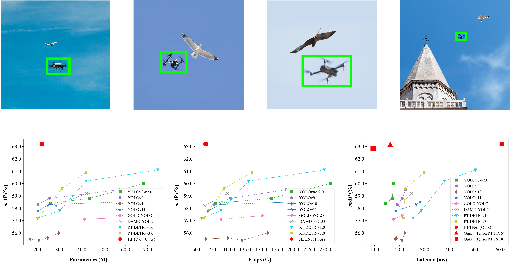

<h1> 
  <p align=center> HFTNet: Hierarchical Frequency Transformer Network for Small Drone Detection in Cluttered Scenes </p>
<div align="center">


[](README.md)

</div>
</h1>


## Model Zoo 

<table>
  <thead align="center">
    <tr>
      <th>Model</th>
      <th>Dataset</th>
      <th>Resolution</th>
      <th>Epoch</th>
      <th>Params(M)</th>
      <th>FLOPs(G)</th>
      <th>$AP$</th>
      <th>$AP_{50}$</th>
      <th>$AP_{75}$</th>
      <th>Baidu Netdisk</th>
    </tr>
  </thead>
  <tbody align="center">
    <tr>
      <td>HFTNet</td>
      <td>DUT-Plus</td>
      <td>640</td>
      <td>200</td>
      <td>23.4</td>
      <td>72.3</td>
      <td>62.9</td>
      <td>92.9</td>
      <td>71.4</td>
      <td><a href="https://pan.baidu.com/s/1p7O-9cWDeccbmRsk5uOzTg?pwd=9tdj">HFTNet_DUT-Plus.pt</a> (code: 9tdj)</td>
    </tr>
    <tr>
      <td>HFTNet</td>
      <td>Det-Fly</td>
      <td>640</td>
      <td>200</td>
      <td>23.4</td>
      <td>72.3</td>
      <td>63.3</td>
      <td>97.1</td>
      <td>72.1</td>
      <td><a href="https://pan.baidu.com/s/14chz4BlkGzTs_2dqx9JTeQ?pwd=ha76">HFTNet_Det-Fly.pt</a> (code: ha76)</td>
    </tr>
  </tbody>
</table>

- Results of the mAP are evaluated on the DUT-Plus dataset (an augmented version of the [DUT-Anti-UAV](https://github.com/wangdongdut/DUT-Anti-UAV) dataset, available at [DUT-Plus](https://github.com/wanq501/DUT-Plus)) and on the [Det-Fly](https://github.com/Jake-WU/Det-Fly) dataset with an input resolution of 640x640.
- All models are trained from scratch without using pretrained weights.

## Deployment

<table>
  <thead align="center">
    <tr>
      <th>Backend</th>
      <th>Precision</th>
      <th>DUT-Plus $AP$</th>
      <th>DUT-Plus Latency (ms)</th>
      <th>Det-Fly $AP$</th>
      <th>Det-Fly Latency (ms)</th>
    </tr>
  </thead>
  <tbody align="center">
    <tr>
      <td>PyTorch</td>
      <td>FP32</td>
      <td>62.9</td>
      <td>62.75</td>
      <td>63.3</td>
      <td>68.40</td>
    </tr>
    <tr>
      <td>TensorRT</td>
      <td>FP16</td>
      <td>62.9</td>
      <td>13.51</td>
      <td>63.3</td>
      <td>16.21</td>
    </tr>
  </tbody>
</table>

- Latency is the sum of preprocessing, inference, and post-processing per image, measured on a single NVIDIA RTX 3080Ti GPU with batch size 1, CUDA 12.1, and TensorRT 8.6.
- Following standard mixed-precision practice, the FP16 engine keeps the layer normalization layers in FP32 and retains the full-precision $AP$.
- Post-training INT8 quantization lowers the DUT-Plus $AP$ by 2.5 points while saving less than 4% of the latency, so it is not used.

## Code Release

All components are available.

| Component | Status |
| :-- | :-- |
| Model weights for DUT-Plus and Det-Fly (Baidu Netdisk links in the Model Zoo) | Available |
| Evaluation, test, and detection scripts | Available |
| TensorRT export script (FP16 engine with layer normalization in FP32, optional INT8 calibration) | Available |
| Dataset splits of DUT-Plus and Det-Fly | Available |
| Source code of HFEN, DIFI, BDFN, and SOIoU, and the training pipeline | Available |

## Dependencies and Installation 

1. Clone and enter the repo.

   ```shell
   git clone https://github.com/wanq501/HFTNet.git
   cd HFTNet
   ```

2. Install dependencies

   ```shell
   pip install -e .
   ```

3. Install the deployment dependencies (only required for TensorRT export)

   ```shell
   pip install onnx onnxsim tensorrt==8.6.1
   ```

## Training and Evaluation 

1. Training (the defaults reproduce the paper: SOIoU box loss, IoU_inner query target, batch 42, 200 epochs)

   ```shell
   python tools/train.py --data path/to/DUT-Plus.yaml --name HFTNet-DUT-Plus --device 0
   ```

2. Evaluation

   ```shell
   python tools/val.py --weights HFTNet_DUT-Plus.pt --data path/to/DUT-Plus.yaml --split val --device 0
   ```

3. Test

   ```shell
   python tools/test.py --weights HFTNet_DUT-Plus.pt --data path/to/DUT-Plus.yaml --device 0
   ```

4. Detect

   ```shell
   python tools/detect.py --weights HFTNet_DUT-Plus.pt --source path/to/images --conf 0.25
   ```

5. Export to TensorRT FP16

   ```shell
   python tools/export.py --weights HFTNet_DUT-Plus.pt --format engine --half
   ```

   The engine is saved next to the weights as `HFTNet_DUT-Plus_fp16.engine`. An exported ONNX file can also be passed to `--weights`.

- Note: Each script includes detailed instructions on how to set parameters and use the script properly.

## Citation

If you find our repo useful for your research, please cite us:

```
@ARTICLE{HFTNet,
  author={Wan, Qian and Feng, Li and Xiao, Zhiwen and Zhu, Zonghai and Xing, Huanlai and Tian, Yunong and Feng, Yurui and Wei, Zong},
  title={HFTNet: Hierarchical Frequency Transformer Network for Small Drone Detection in Cluttered Scenes}, 
  year={2026},
  note={Under review}}

```

This project is based on the open source codebase [Ultralytics](https://github.com/ultralytics/ultralytics) and its RT-DETR implementation. The aggregation block of DFAL adopts RepNCSPELAN4 from YOLOv9, the window attention of DIFI follows Swin Transformer, the deformable convolution is DCNv3, and the upsampling operator is DySample.

```
@inproceedings{RT-DETR,
  author={Zhao, Yian and Lv, Wenyu and Xu, Shangliang and Wei, Jinman and Wang, Guanzhong and Dang, Qingqing and Liu, Yi and Chen, Jie},
  title={DETRs Beat YOLOs on Real-time Object Detection},
  booktitle={Proceedings of the IEEE/CVF Conference on Computer Vision and Pattern Recognition},
  pages={16965--16974},
  year={2024}
}

@misc{YOLOv8,
  author={Glenn Jocher and Ayush Chaurasia and Jing Qiu},
  title={YOLOv8 by Ultralytics},
  version={8.0.0},
  year={2023},
  month={jan},
  license={AGPL-3.0},
  url={https://github.com/ultralytics/ultralytics}
}

@inproceedings{YOLOv9,
  author={Wang, Chien-Yao and Yeh, I-Hau and Liao, Hong-Yuan Mark},
  title={YOLOv9: Learning What You Want to Learn Using Programmable Gradient Information},
  booktitle={Proceedings of the European Conference on Computer Vision},
  year={2024}
}

@inproceedings{Swin,
  author={Liu, Ze and Lin, Yutong and Cao, Yue and Hu, Han and Wei, Yixuan and Zhang, Zheng and Lin, Stephen and Guo, Baining},
  title={Swin Transformer: Hierarchical Vision Transformer using Shifted Windows},
  booktitle={Proceedings of the IEEE/CVF International Conference on Computer Vision},
  pages={10012--10022},
  year={2021}
}

@inproceedings{DCNv3,
  author={Wang, Wenhai and Dai, Jifeng and Chen, Zhe and Huang, Zhenhang and Li, Zhiqi and Zhu, Xizhou and Hu, Xiaowei and Lu, Tong and Lu, Lewei and Li, Hongsheng and Wang, Xiaogang and Qiao, Yu},
  title={InternImage: Exploring Large-Scale Vision Foundation Models with Deformable Convolutions},
  booktitle={Proceedings of the IEEE/CVF Conference on Computer Vision and Pattern Recognition},
  pages={14408--14419},
  year={2023}
}

@inproceedings{DySample,
  author={Liu, Wenze and Lu, Hao and Fu, Hongtao and Cao, Zhiguo},
  title={Learning to Upsample by Learning to Sample},
  booktitle={Proceedings of the IEEE/CVF International Conference on Computer Vision},
  pages={6027--6037},
  year={2023}
}
```
